## Тестовое домашнее задание для Инженера технической поддержки
1. Необходимо развернуть систему мониторинга (желательно – VictoriaMetrics) в режиме кластера и резервирования всех ее компонентов на ОС Debian или Ubuntu (желательно – Ubuntu 24.04.2);
2. В качестве среды развертывания использовать технологию контейнеризации Docker;
3. Запустить многоконтейнерную инсталляцию через Docker-compose;
4. В качестве хранилищ использовать каталоги на локальном сервере по пути /mnt/storage{1,2};
5. Подключить агента на которого будут собираться метрики производительности (ЦПУ, Память, Диск, Сеть);
6. В качестве инструмента визуализации метрик использовать Grafana;
7. Обеспечить доступ к сервису Grafana по https и на стандартном порту 443;
8. Создать дашборды в Grafana с визуализацией производительности подключённого агента.

**Ожидаемый результат:** Описан порядок действий, сделаны скриншоты командной строки, сделаны скриншоты дашбордов. Чем подробней, чем больше скриншотов, тем лучше.
## Выполнение задания
### Подготовка окружения
1. Установил [Ubuntu 24.04.2](https://old-releases.ubuntu.com/releases/24.04.2/) (ubuntu-24.04.2-live-server-amd64.iso) на выделенный сервер (далее `blackbox`). Во время инсталляции выбрал `openssh` как дополнительный пакет по-умолчанию.
2. Подключился к хосту по SSH по локальному DNS, статический адрес прописан на маршрутизаторе.
```
ssh blackbox
```
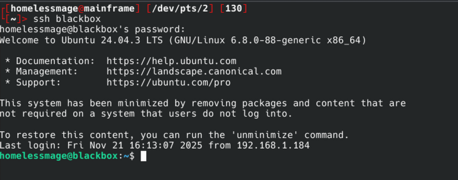
3. Обновление всей системы:
```
homelessmage@blackbox:~$ sudo apt update && sudo apt upgrade -y && sudo apt autoremove -y
```
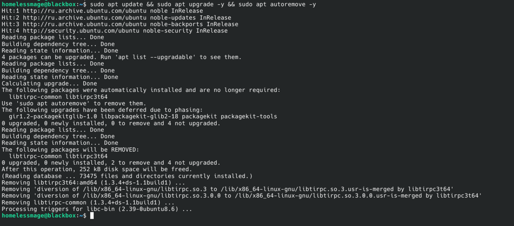
4. Прописал `.pub` ключ для аутентификации без пароля в `~/.ssh/authorized_keys`
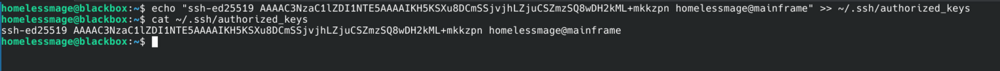
5. Установил `nano` для удобства редактирования текстовых файлов

5. Отредактировал `/etc/ssh/sshd_config`
```
PermitRootLogin no
PasswordAuthentication no
PermitEmptyPasswords no
UsePAM no
```
6. Перезапустил демон `ssh` и подключился используя ключ
```
sudo systemctl restart ssh
exit
ssh blackbox
```
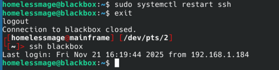
### Установка Docker
7. Установка Docker по [инструкции от разработчиков](https://docs.docker.com/engine/install/ubuntu/#install-using-the-convenience-script)

8. Добавил пользователя в группу `docker`
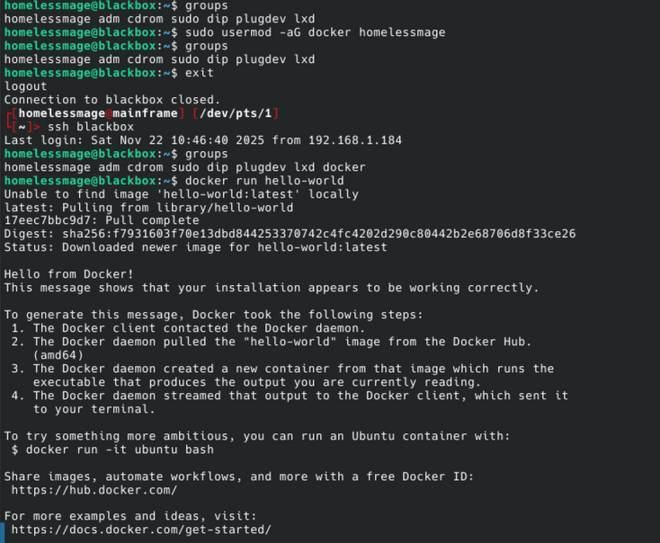
### Создание каталогов
9. В качестве хранилища решил использовать массив RAID1 из двух доступных свободных дисков по пути `/mnt/md0`
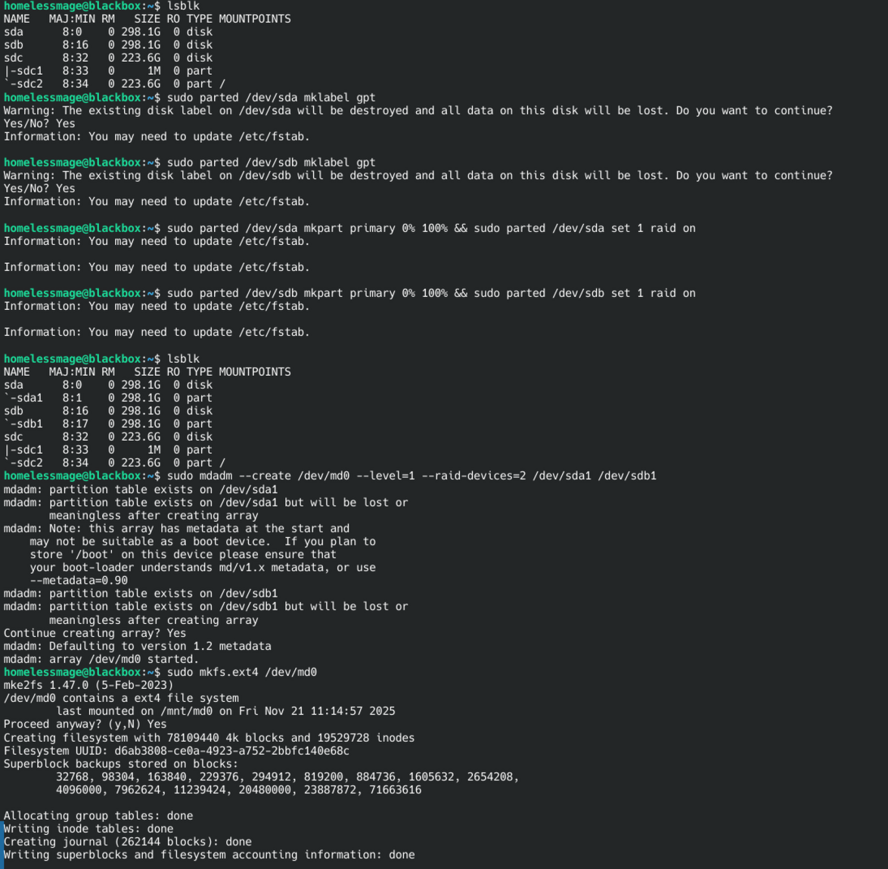 
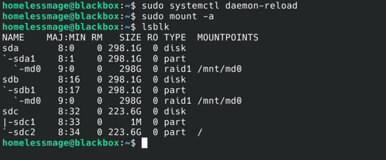
10. Создание директорий
- `/mnt/md0/storage1/vmstorage0` и `/mnt/md0/storage1/vmstorage1` будут хранить данные для двух экземпляров `vmstorage` обеспечивая резервирование
- `/mnt/md0/storage2/grafana` будет хранить конфигурацию и базу данных Grafana

Исправлю права на запись из-за возникнувших позже проблем с контейнером Grafana

### Развертывание сервисов
Исходя из задания для обеспечения кластерного режима и резервирования VictoriaMetrics необходимо развернуть как минимум следующие компоненты:
- `vminsert`: принимает метрики и распределяет их между узлами `vmstorage`.
- `vmstorage`: хранит метрики и обеспечивает резервирование
- `vmselect`: выполняет запросы к узлам `vmstorage`
- `vmagent`: собирает метрики и отправляет их в `vminsert`
- Grafana: Визуализация
11. Создал `docker-compose.yml`
```
version: '3.7'

services:
  vmstorage-0:
    image: victoriametrics/vmstorage:v1.130.0-cluster
    container_name: vmstorage-0
    volumes:
      - /mnt/md0/storage1/vmstorage0:/victoria-metrics-data 
    command:
      - '--storageDataPath=/victoria-metrics-data'
      - '--retentionPeriod=1y'
      - '--vminsertAddr=:8400'
      - '--vmselectAddr=:8401'
    restart: always
    networks:
      - vm_network

  vmstorage-1:
    image: victoriametrics/vmstorage:v1.130.0-cluster
    container_name: vmstorage-1
    volumes:
      - /mnt/md0/storage1/vmstorage1:/victoria-metrics-data
    command:
      - '--storageDataPath=/victoria-metrics-data'
      - '--retentionPeriod=1y'
      - '--vminsertAddr=:8400'
      - '--vmselectAddr=:8401'
    restart: always
    networks:
      - vm_network
    
  vminsert:
    image: victoriametrics/vminsert:v1.130.0-cluster
    container_name: vminsert
    depends_on:
      - vmstorage-0
      - vmstorage-1
    command:
      - '--storageNode=vmstorage-0:8400'
      - '--storageNode=vmstorage-1:8400'
    ports:
      - "8480:8480"
    restart: always
    networks:
      - vm_network

  vmselect:
    image: victoriametrics/vmselect:v1.130.0-cluster
    container_name: vmselect
    depends_on:
      - vmstorage-0
      - vmstorage-1
    command:
      - '--storageNode=vmstorage-0:8401'
      - '--storageNode=vmstorage-1:8401'
    ports:
      - "8481:8481"
    restart: always
    networks:
      - vm_network

  vmagent:
    image: victoriametrics/vmagent:v1.130.0
    container_name: vmagent
    command:
      - '--remoteWrite.url=http://vminsert:8480/insert/0/prometheus/api/v1/write'
      - '--promscrape.config=/etc/vmagent/prometheus.yml'
    volumes:
      - ./prometheus.yml:/etc/vmagent/prometheus.yml:ro
    ports:
      - "8429:8429"
    depends_on:
      - vminsert
      - node-exporter
    restart: always
    networks:
      - vm_network

  node-exporter:
    image: prom/node-exporter:latest
    container_name: node-exporter
    volumes:
      - /:/host:ro,rslave
    command:
      - '--path.rootfs=/host'
    ports:
      - "9100:9100"
    restart: always
    networks:
      - vm_network

  grafana:
    image: grafana/grafana:latest
    container_name: grafana
    depends_on:
      - vmselect
    ports:
      - "3000:3000"
    environment:
      - GF_SECURITY_ADMIN_USER=admin
      - GF_SECURITY_ADMIN_PASSWORD=admin
      - GF_INSTALL_PLUGINS=grafana-clock-panel,grafana-simple-json-datasource
    volumes:
      - /mnt/md0/storage2/grafana:/var/lib/grafana
    restart: always
    networks:
      - vm_network

networks:
  vm_network:
    driver: bridge
```
12. Создал `prometheus.yml`
```
global:
  scrape_interval: 15s

scrape_configs:
  - job_name: 'node-exporter-vm'
    static_configs:
      - targets: ['node-exporter:9100']
    metrics_path: /metrics
    scrape_interval: 15s
```

12. Запуск контейнеров
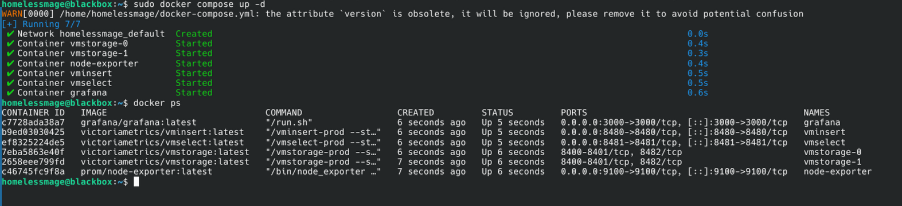
### Настройка HTTPS
Так как у меня уже есть Nginx на другом сервере (далее redbox), я просто перенаправлю через обратный прокси обращения к домену `monitoring.homelessmage.oops.wtf`.
12. На redbox запросил SSL сертификат через `certbot`
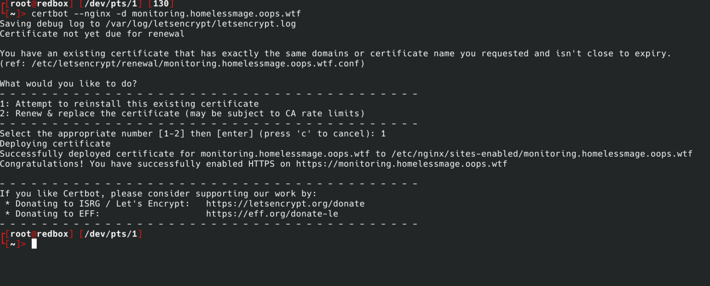
13. На redbox создал конфигурацию в `/etc/nginx/sites-available`
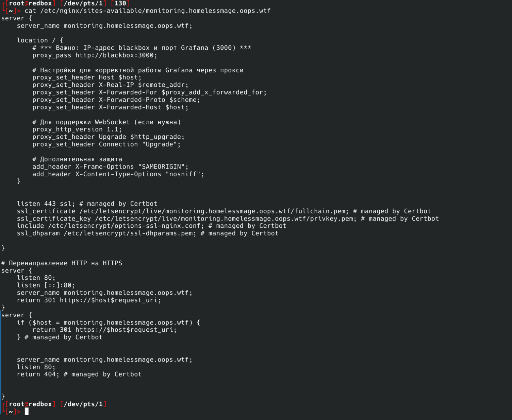
Проверил конфиг: `nginx -t` и перезапустил демон: `systemctl restart nginx`
14. Проверил работу
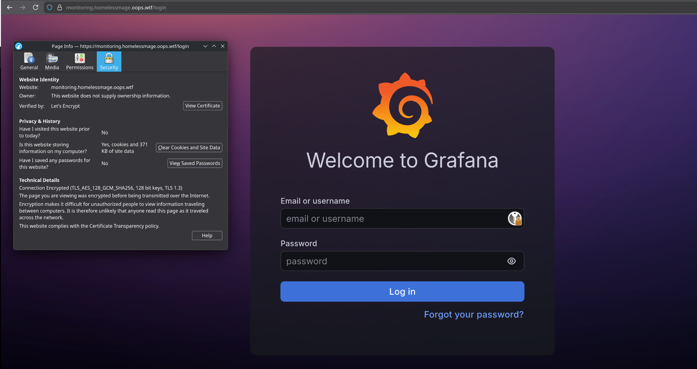
### Настройка визуализации в Grafana
15. Добавил источник данных

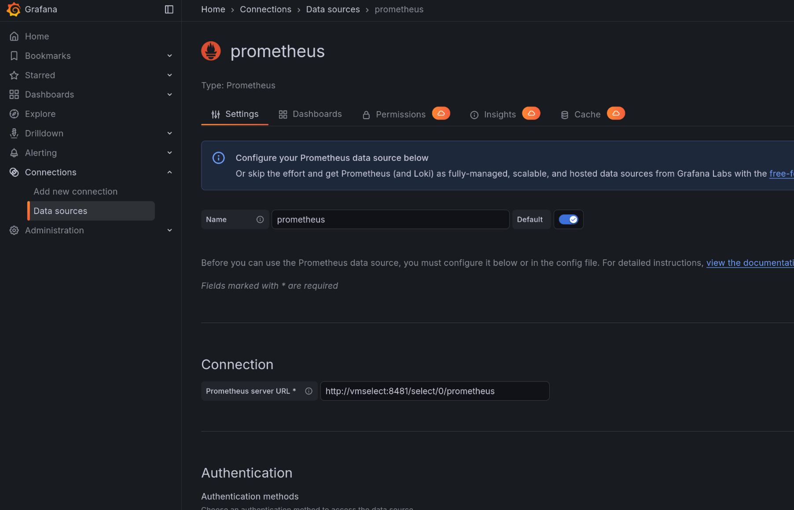
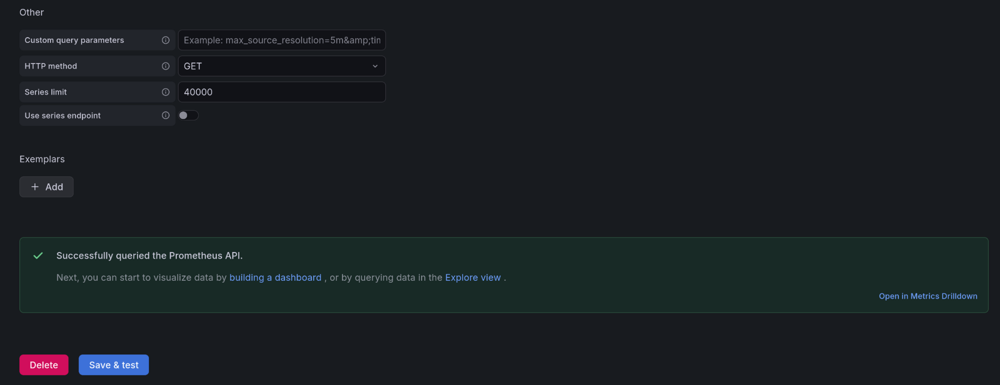
16. Создал дэшборд, импортировав [пресет сайта Grafana](https://grafana.com/grafana/dashboards/1860-node-exporter-full/)
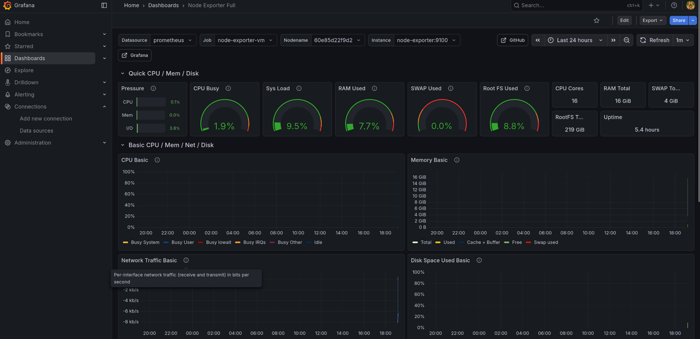

### Итоги
1. Развернул систему мониторинга VictoriaMetrics в режиме кластера и резервирования всех ее компонентов на Ubuntu 24.04.2;
2. В качестве среды развертывания использовал технологию контейнеризации Docker;
3. Запустил многоконтейнерную инсталляцию через Docker-compose;
4. В качестве хранилищ использовал каталоги на локальном сервере по пути /mnt/md0/storage{1,2} в отказоустойчивом RAID1 массиве;
5. Подключил localhost-агента на которого будут собираются метрики производительности (ЦПУ, Память, Диск, Сеть);
6. В качестве инструмента визуализации метрик использовал Grafana;
7. Обеспечил доступ к сервису Grafana по https и на стандартном порту 443;
8. Создал дашборды в Grafana с визуализацией производительности подключённого агента.

Grafana доступна по адресу: https://monitoring.homelessmage.oops.wtf
Логин: **sber-interview**
Пароль: по запросу

В общем установка и настройка заняла у меня около одного рабочего дня, учитывая что я это делал впервые!

Документ написан в markdown, сконвертирован в PDF

# 🐧 said.gogushev@gmail.com | [@homelessmage](https://t.me/homelessmage)